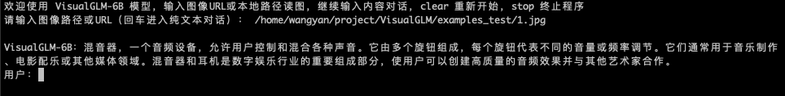

# VisualGLM-6B

<p align="center">
🤗 <a href="https://huggingface.co/THUDM/chatglm-6b" target="_blank">HF Repo(TODO link)</a> • ⚒️ <a href="https://github.com/THUDM/SwissArmyTransformer" target="_blank">SwissArmyTransformer (sat)</a> • 🐦 <a href="https://twitter.com/thukeg" target="_blank">Twitter</a> •  📃 <a href="https://arxiv.org/abs/2105.13290" target="_blank">[CogView@NeurIPS 21]</a>  <a href="https://github.com/THUDM/CogView" target="_blank">[GitHub]</a> • 📃 <a href="https://arxiv.org/abs/2103.10360" target="_blank">[GLM@ACL 22]</a> <a href="https://github.com/THUDM/GLM" target="_blank">[GitHub]</a> <br>
</p>
<p align="center">
    👋 加入我们的 <a href="https://join.slack.com/t/chatglm/shared_invite/zt-1th2q5u69-7tURzFuOPanmuHy9hsZnKA" target="_blank">Slack</a> 和 <a href="resources/WECHAT.md" target="_blank">WeChat</a>
</p>
<p align="center">
🤖<a href="https://huggingface.co/spaces/lykeven/visualglm-6b" target="_blank">VisualGLM-6B在线演示网站</a>
</p>

## 介绍

VisualGLM-6B 是一个开源的，支持**图像、中文和英文**的多模态对话语言模型，语言模型基于 [ChatGLM-6B](https://github.com/THUDM/ChatGLM-6B)，具有 62 亿参数；图像部分通过训练 [BLIP2-Qformer](https://arxiv.org/abs/2301.12597) 构建起视觉模型与语言模型的桥梁，整体模型共78亿参数。

VisualGLM-6B 依靠来自于 [CogView](https://arxiv.org/abs/2105.13290) 数据集的30M高质量中文图文对，与300M经过筛选的英文图文对进行预训练，中英文权重相同。该训练方式较好地将视觉信息对齐到ChatGLM的语义空间；之后的微调阶段，模型在长视觉问答数据上训练，以生成符合人类偏好的答案。

VisualGLM-6B 由 [SwissArmyTransformer](https://github.com/THUDM/SwissArmyTransformer)(`sat`) 库训练，这是一个支持Transformer灵活修改、训练的工具库，支持Lora、P-tuning等参数高效微调方法。本项目提供了符合用户习惯的huggingface接口，也提供了基于sat的[训练样例(TODO)]()。

不过，由于 VisualGLM-6B 仍处于v1版本，目前已知其具有相当多的[**局限性**](#局限性)，如图像描述事实性/模型幻觉问题，图像细节信息捕捉不足，以及一些来自语言模型的局限性。请大家在使用前了解这些问题，评估可能存在的风险。在VisualGLM之后的版本中，将会着力对此类问题进行优化。

结合模型量化技术，用户可以在消费级的显卡上进行本地部署（INT4 量化级别下最低只需 **TODO** 显存）。

<!-- **想要提升 ChatGLM-6B 在你的实际场景中的表现？请参与 [ChatGLM-6B 提升计划](improve/README.md)**
 -->
<!--  为了方便下游开发者针对自己的应用场景定制模型，我们同时实现了基于 [P-Tuning v2](https://github.com/THUDM/P-tuning-v2) 的高效参数微调方法 [(使用指南)](ptuning/README.md) ，INT4 量化级别下最低只需 7GB 显存即可启动微调。
 -->
*Read this in [English](README_en.md). TODO*

## 样例


## 使用

### 模型推理

使用pip安装依赖
```
pip install -r requirements.txt
```

如果使用Huggingface transformers库调用模型，可以通过如下代码（其中图像路径为本地路径）：
```python
TODO
>>> from transformers import AutoTokenizer, AutoModel
>>> tokenizer = AutoTokenizer.from_pretrained("THUDM/chatglm-6b", trust_remote_code=True)
>>> model = AutoModel.from_pretrained("THUDM/chatglm-6b", trust_remote_code=True).half().cuda()
>>> model = model.eval()
>>> response, history = model.chat(tokenizer, "你好", history=[])
>>> print(response)
你好👋!我是人工智能助手 ChatGLM-6B,很高兴见到你,欢迎问我任何问题。
>>> response, history = model.chat(tokenizer, "晚上睡不着应该怎么办", history=history)
>>> print(response)
晚上睡不着可能会让你感到焦虑或不舒服,但以下是一些可以帮助你入睡的方法:
```

如果使用SwissArmyTransformer库调用模型，方法类似。具体代码如下：
```python
TODO
>>> from transformers import AutoTokenizer, AutoModel
>>> tokenizer = AutoTokenizer.from_pretrained("THUDM/chatglm-6b", trust_remote_code=True)
>>> model = AutoModel.from_pretrained("THUDM/chatglm-6b", trust_remote_code=True).half().cuda()
>>> model = model.eval()
>>> response, history = model.chat(tokenizer, "你好", history=[])
>>> print(response)
你好👋!我是人工智能助手 ChatGLM-6B,很高兴见到你,欢迎问我任何问题。
>>> response, history = model.chat(tokenizer, "晚上睡不着应该怎么办", history=history)
>>> print(response)
晚上睡不着可能会让你感到焦虑或不舒服,但以下是一些可以帮助你入睡的方法:
```
### 高效微调
本项目提供了基于`sat`库进行参数高效微调的例子，该方法在半精度下需要TODO G显存。

TODO 具体代码

### 加载本地模型

对于通过`sat`训练得到的模型，可以通过如下方法加载。

TODO 具体代码

主要不同是 TODO。

## Demo & API

我们提供了一个基于 [Gradio](https://gradio.app) 的网页版 Demo，使用时首先需要下载本仓库：

```shell
git clone https://github.com/THUDM/VisualGLM-6B
cd VisualGLM-6B
```

#### 网页版 Demo


首先安装 Gradio：`pip install gradio`，然后运行仓库中的 [web_demo.py](web_demo.py)： 

```shell
python web_demo.py
```

程序会运行一个 Web Server，并输出地址。在浏览器中打开输出的地址即可使用。


#### 命令行 Demo



```shell
python cli_demo.py
```

程序会在命令行中进行交互式的对话，在命令行中输入指示并回车即可生成回复，输入 clear 可以清空对话历史，输入 stop 终止程序。


### API部署
首先需要安装额外的依赖 `pip install fastapi uvicorn`，然后运行仓库中的 [api.py](api.py)：
```shell
python api.py
```
默认部署在本地的 8080 端口，通过 POST 方法进行调用。
```shell
curl -X POST "http://127.0.0.1:8080" \
     -H 'Content-Type: application/json' \
     -d '{"text": "描述这张图片", "history": [], "image_prompt": "Base64 encoded bytes of examples/2.jpeg"}'
```
得到的返回值为
```shell
{
  "response":"这张图片展现了一只可爱的卡通羊驼，它站在一个透明的背景上。这只羊驼长着一张毛茸茸的耳朵和一双大大的眼睛，它的身体是白色的，带有棕色斑点。",
  "history":[('描述这张图片', '这张图片展现了一只可爱的卡通羊驼，它站在一个透明的背景上。这只羊驼长着一张毛茸茸的耳朵和一双大大的眼睛，它的身体是白色的，带有棕色斑点。')],
  "status":200,
  "time":"2023-05-16 20:20:10"
}
```

## 局限性

- 图像描述事实性/模型幻觉问题。在生成图像长描述的时候，距离图像较远时，语言模型的将占主导，有一定可能根据上下文生成并不存在于图像的内容。

## 协议

## 引用
```
@inproceedings{du2022glm,
  title={GLM: General Language Model Pretraining with Autoregressive Blank Infilling},
  author={Du, Zhengxiao and Qian, Yujie and Liu, Xiao and Ding, Ming and Qiu, Jiezhong and Yang, Zhilin and Tang, Jie},
  booktitle={Proceedings of the 60th Annual Meeting of the Association for Computational Linguistics (Volume 1: Long Papers)},
  pages={320--335},
  year={2022}
}
@article{ding2021cogview,
  title={Cogview: Mastering text-to-image generation via transformers},
  author={Ding, Ming and Yang, Zhuoyi and Hong, Wenyi and Zheng, Wendi and Zhou, Chang and Yin, Da and Lin, Junyang and Zou, Xu and Shao, Zhou and Yang, Hongxia and others},
  journal={Advances in Neural Information Processing Systems},
  volume={34},
  pages={19822--19835},
  year={2021}
}
```

