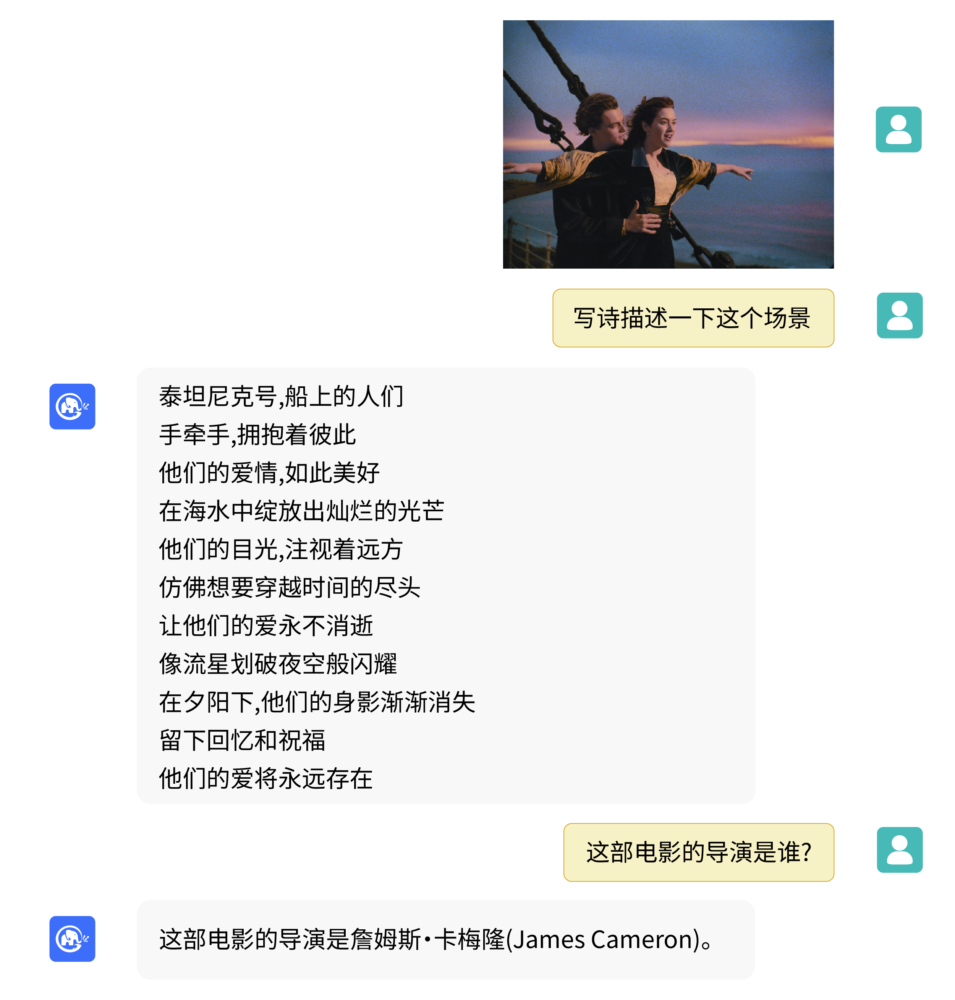
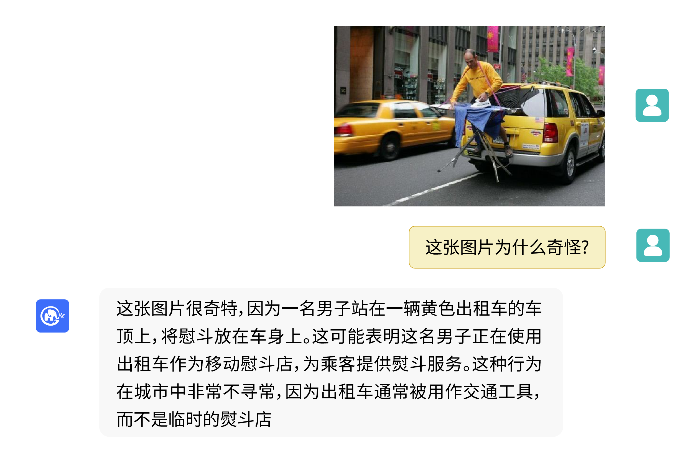
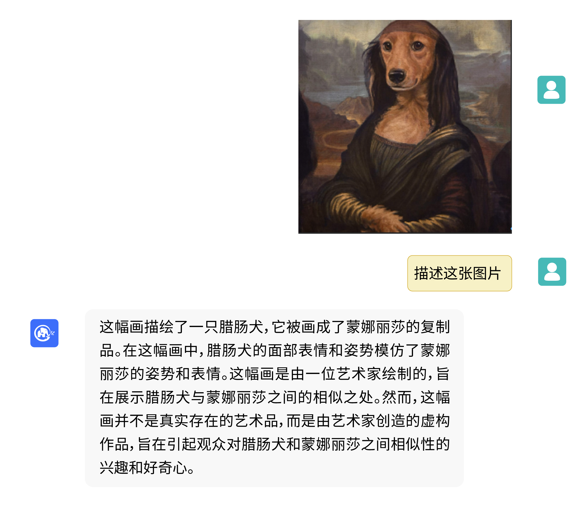
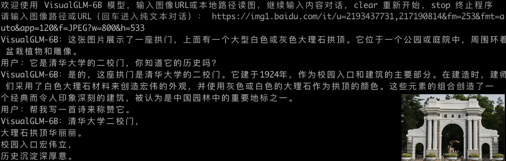
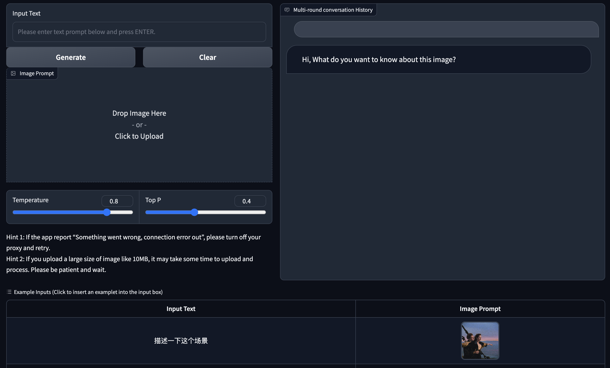

# VisualGLM-6B
<p align="center">
🤗 <a href="https://huggingface.co/THUDM/visualglm-6b" target="_blank">HF Repo</a> • ⚒️ <a href="https://github.com/THUDM/SwissArmyTransformer" target="_blank">SwissArmyTransformer (sat)</a> • 🐦 <a href="https://twitter.com/thukeg" target="_blank">Twitter</a> 
</p>
<p align="center">
•  📃 <a href="https://arxiv.org/abs/2105.13290" target="_blank">[CogView@NeurIPS 21]</a>  <a href="https://github.com/THUDM/CogView" target="_blank">[GitHub]</a> • 📃 <a href="https://arxiv.org/abs/2103.10360" target="_blank">[GLM@ACL 22]</a> <a href="https://github.com/THUDM/GLM" target="_blank">[GitHub]</a> <br>
</p>
<p align="center">
    👋 Join us on <a href="https://join.slack.com/t/chatglm/shared_invite/zt-1th2q5u69-7tURzFuOPanmuHy9hsZnKA" target="_blank">Slack</a> and <a href="resources/WECHAT.md" target="_blank">WeChat</a>
</p>
<!-- <p align="center">
🤖<a href="https://huggingface.co/spaces/THUDM/visualglm-6b" target="_blank">VisualGLM-6B Online Demo Website</a>
</p> -->

## Introduction
VisualGLM-6B is an open-source, multi-modal dialog language model that supports **images, Chinese, and English**. The language model is based on [ChatGLM-6B](https://github.com/THUDM/ChatGLM-6B) with 6.2 billion parameters; the image part builds a bridge between the visual model and the language model through the training of [BLIP2-Qformer](https://arxiv.org/abs/2301.12597), with the total model comprising 7.8 billion parameters.

VisualGLM-6B relies on 30M high-quality Chinese image-text pairs from the [CogView](https://arxiv.org/abs/2105.13290) dataset and 300M filtered English image-text pairs for pre-training, with equal weight for Chinese and English. This training method aligns visual information well to the semantic space of ChatGLM. In the subsequent fine-tuning phase, the model is trained on long visual question answering data to generate answers that align with human preferences.

VisualGLM-6B is trained using the [SwissArmyTransformer](https://github.com/THUDM/SwissArmyTransformer) (abbreviated as sat) library, a utility library for flexible modification and training of Transformer, supporting efficient fine-tuning methods like Lora and P-tuning. This project provides a user-friendly huggingface interface, as well as an interface based on sat.

However, as VisualGLM-6B is still at the v1 stage, it is known to have quite a few [**limitations**](#Limitations), such as factual inaccuracy/model hallucination in image description, lack of capturing image detail information, and some limitations from the language model. Please be aware of these issues and evaluate the potential risks before using. In future versions of VisualGLM, we will strive to optimize these issues.

With model quantization technology, users can deploy locally on consumer-grade graphics cards (requiring as little as 8.7G memory under INT4 quantization level).

## Examples
VisualGLM-6B can answer questions related to image description.


<details>
<summary>It can also combine common sense or propose interesting views. Click to expand/collapse more examples</summary>




</details>


## Usage

### Model Inference

Install dependencies with pip
```
pip install -i https://pypi.org/simple -r requirements.txt
pip install -i https://mirrors.aliyun.com/pypi/simple/ -r requirements.txt
```
This will default to installing the deepspeed library (which supports the sat library training). This library is not necessary for model inference and can cause problems when installed in some Windows environments.
If you want to bypass deepspeed installation, you can change the command to:
```
pip install -i https://mirrors.aliyun.com/pypi/simple/ -r requirements_wo_ds.txt
pip install -i https://mirrors.aliyun.com/pypi/simple/ --no-deps "SwissArmyTransformer>=0.3.6"
```

If you are calling the model using the Huggingface transformers library (you also need to install the above dependency packages!), you can use the following code (where the image path is the local path):
```python
from transformers import AutoTokenizer, AutoModel
tokenizer = AutoTokenizer.from_pretrained("THUDM/visualglm-6b", trust_remote_code=True)
model = AutoModel.from_pretrained("THUDM/visualglm-6b", trust_remote_code=True).half().cuda()
image_path = "your image path"
response, history = model.chat(tokenizer, image_path, "描述这张图片。", history=[])
print(response)
response, history = model.chat(tokenizer, image_path, "这张图片可能是在什么场所拍摄的？", history=history)
print(response)
```

If you use the SwissArmyTransformer library to call the model, the method is similar, and you can use the environment variable SAT_HOME to determine the model download location. In the directory of this repository:
```python
import argparse
from transformers import AutoTokenizer
tokenizer = AutoTokenizer.from_pretrained("THUDM/chatglm-6b", trust_remote_code=True)
from model import chat, VisualGLMModel
model, model_args = VisualGLMModel.from_pretrained('visualglm-6b', args=argparse.Namespace(fp16=True, skip_init=True))
from sat.model.mixins import CachedAutoregressiveMixin
model.add_mixin('auto-regressive', CachedAutoregressiveMixin())
image_path = "your image path or URL"
response, history, cache_image = chat(image_path, model, tokenizer, "Describe this picture.", history=[])
print(response)
response, history, cache_image = chat(None, model, tokenizer, "Where could this picture possibly have been taken?", history=history, image=cache_image)
print(response)
```

Using the `sat` library can also easily carry out efficient parameter fine-tuning. <!-- TODO specific code -->

Please note that the Huggingface model implementation is located in the [Huggingface repository](https://huggingface.co/THUDM/visualglm-6b), and the `sat` model implementation is included in this repository.

## Model Fine-tuning

Multimodal tasks are wide-ranging and diverse, and pre-training often cannot cover all bases.
Here we provide an example of small sample fine-tuning, using 20 labeled images to enhance the model's ability to answer "background" questions.

After unzipping fewshot-data.zip, run the following command:
```
bash finetune/finetune_visualglm.sh
```

Currently we support three types of (parameter-efficient) fine-tuning:

* LoRA: In the given example, we add rank=10 LoRA for layer 0 and layer 14 in ChatGLM. You can adjust `--layer_range` and `--lora_rank` to fit your application and data amount.
* QLoRA: If your resource is limited, consider using `bash finetune/finetune_visualglm_qlora.sh`, which do 4-bit quantization for ChatGLM Linear layers, reducing the required GPU memory to 9.8 GB.
* P-tuning: You can replace `--use_lora` to `--use_ptuning`, but not recommended, unless your application has a relatively fixed input and output template.

After training, you can use the following command for inference:

```
python cli_demo.py --from_pretrained your_checkpoint_path --prompt_zh 这张图片的背景里有什么内容？
```

Fine-tuning requires the installation of the deepspeed library, and currently this process only supports the Linux system. More examples and instructions for the Windows system will be completed in the near future.

If you want to merge LoRA weights into original weights, just call `merge_lora()`:

```python
from finetune_visualglm import FineTuneVisualGLMModel
import argparse

model, args = FineTuneVisualGLMModel.from_pretrained('checkpoints/finetune-visualglm-6b-05-19-07-36',
        args=argparse.Namespace(
        fp16=True,
        skip_init=True,
        use_gpu_initialization=True,
        device='cuda',
    ))
model.get_mixin('lora').merge_lora()
args.layer_range = []
args.save = 'merge_lora'
args.mode = 'inference'
from sat.training.model_io import save_checkpoint
save_checkpoint(1, model, None, None, args)
```

## Deployment Tools

### Command Line Demo

```shell
python cli_demo.py 
```
The program will automatically download the sat model and interact in the command line. You can generate replies by entering instructions and pressing enter. Enter 'clear' to clear the conversation history and 'stop' to stop the program.


The program provides the following hyperparameters to control the generation process and quantization accuracy:
```
usage: cli_demo.py [-h] [--max_length MAX_LENGTH] [--top_p TOP_P] [--top_k TOP_K] [--temperature TEMPERATURE] [--english] [--quant {8,4}]

optional arguments:
  -h, --help            show this help message and exit
  --max_length MAX_LENGTH
                        max length of the total sequence
  --top_p TOP_P         top p for nucleus sampling
  --top_k TOP_K         top k for top k sampling
  --temperature TEMPERATURE
                        temperature for sampling
  --english             only output English
  --quant {8,4}         quantization bits
```
Note that during training, the prompt words for English Q&A pairs are 'Q: A:', while in Chinese they are '问：答：'. The web demo uses Chinese prompts, so the English replies will be worse and interspersed with Chinese; if you need English replies, please use the --english option in cli_demo.py.

We also provide a typewriter effect command line tool inherited from ChatGLM-6B, which uses the Huggingface model:
```shell
python cli_demo_hf.py
```

### Web Demo


We provide a web demo based on [Gradio](https://gradio.app). First, install Gradio: `pip install gradio`.
Then download and enter this repository and run `web_demo.py`:

```
git clone https://github.com/THUDM/VisualGLM-6B
cd VisualGLM-6B
python web_demo.py
```
The program will automatically download the sat model and run a Web Server, outputting the address. Open the output address in your browser to use it.

We also provide a web tool with a typewriter effect inherited from ChatGLM-6B, which uses the Huggingface model and will run on port :8080 after starting:
```shell
python web_demo_hf.py
```

Both web demos accept the command line parameter --share to generate a public link for gradio, and accept --quant 4 and --quant 8 to use 4-bit quantization/8-bit quantization to reduce GPU memory usage.

### API Deployment
First, you need to install additional dependencies pip install fastapi uvicorn, then run the api.py in the repository:
```shell
python api.py
```
The program will automatically download the sat model, and by default it will be deployed on local port 8080 and called through the POST method. Below is an example of a request with curl, but in general you can also use a code method to POST.
```shell
echo "{\"image\":\"$(base64 path/to/example.jpg)\",\"text\":\"Describe this picture\",\"history\":[]}" > temp.json
curl -X POST -H "Content-Type: application/json" -d @temp.json http://127.0.0.1:8080
```

We also provide an api_hf.py that uses the Huggingface model, which works the same way as the sat model's api:
```shell
python api_hf.py
```


## Model Quantization
In the Huggingface implementation, the model is loaded with FP16 precision by default, and running the above code requires about 15GB of GPU memory. If your GPU memory is limited, you can try loading the model in a quantized manner.
Here's how:
```python
# Modify as needed, currently only 4/8 bit quantization is supported. The following will only quantize ChatGLM, as the error is larger when quantizing ViT
model = AutoModel.from_pretrained("THUDM/visualglm-6b", trust_remote_code=True).quantize(8).half().cuda()
```

In the sat implementation, you need to change the loading location to 'cpu' first, and then perform quantization. Here's how, see cli_demo.py for details:
```python
from sat.quantization.kernels import quantize
model = quantize(model.transformer, args.quant).cuda()
# Specify model.transformer to only quantize ChatGLM, as the error is larger when quantizing ViT
```

## Limitations
This project is currently at V1 version of the visual and language model parameters, the amount of calculation is small, we have summarized the following main improvements:

- Image description factuality/model hallucination problem. When generating long descriptions of images, as the distance from the image increases, the language model will dominate, and there is a certain possibility of generating content that does not exist in the image based on the context.
- Attribute mismatch problem. In scenes with multiple objects, some attributes of some objects are often incorrectly inserted onto other objects.
- Resolution issue. This project uses a resolution of 224*224, which is the most commonly used size in visual models; however, for more fine-grained understanding, larger resolution and computation are necessary.
- Due to data and other reasons, the model currently does not have the ability to perform Chinese OCR (some ability for English OCR), we will add this ability in future versions.
## License

The code in this repository is open source under the Apache-2.0 license, while the use of the VisualGLM-6B model weights must comply with the Model License.

## Citation & Acknowledgements
If you find our work helpful, please consider citing the following papers
```
@inproceedings{du2022glm,
  title={GLM: General Language Model Pretraining with Autoregressive Blank Infilling},
  author={Du, Zhengxiao and Qian, Yujie and Liu, Xiao and Ding, Ming and Qiu, Jiezhong and Yang, Zhilin and Tang, Jie},
  booktitle={Proceedings of the 60th Annual Meeting of the Association for Computational Linguistics (Volume 1: Long Papers)},
  pages={320--335},
  year={2022}
}
@article{ding2021cogview,
  title={Cogview: Mastering text-to-image generation via transformers},
  author={Ding, Ming and Yang, Zhuoyi and Hong, Wenyi and Zheng, Wendi and Zhou, Chang and Yin, Da and Lin, Junyang and Zou, Xu and Shao, Zhou and Yang, Hongxia and others},
  journal={Advances in Neural Information Processing Systems},
  volume={34},
  pages={19822--19835},
  year={2021}
}
```
In the instruction fine-tuning phase of the VisualGLM-6B dataset, there are some English image-text data from the [MiniGPT-4](https://github.com/Vision-CAIR/MiniGPT-4) and [LLAVA](https://github.com/haotian-liu/LLaVA) projects, as well as many classic cross-modal work datasets. We sincerely thank them for their contributions.
